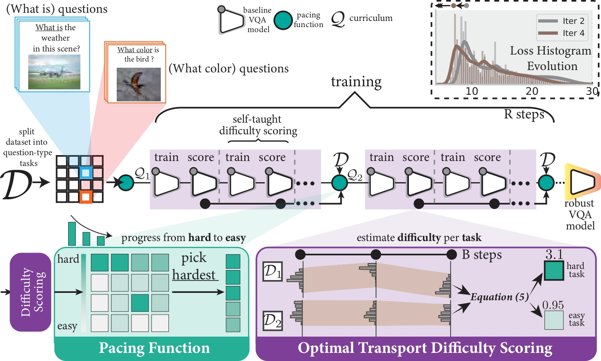

# Task Progressive Curriculum Learning: Approach for Robust Visual Question Answering 


# 
We provide the PyTorch implementation for [Task Progressive Curriculum Learning: Approach for Robust Visual Question Answering]() (BMVC 2025).

<p align="center">

</p>

## Dependencies
* Python version: 3.12.0
* PyTorch version: 2.1.1
* dependencies in requirements.txt
* We train and evaluate all of the models based on one Nvidia
H100 GPU using 48Gb of memory.

## Getting Started

### Installation
1. Clone this repository:

        git clone 
        cd TPCL

2. Install PyTorch and other dependencies:

        pip install -r requirements.txt


### Download and preprocess the data

```
cd data 
bash download.sh
python preprocess_features.py --input_tsv_folder xxx.tsv --output_h5 xxx.h5
python feature_preprocess.py --input_h5 xxx.h5 --output_path trainval 
python create_dictionary.py --dataroot vqacp2/
python preprocess_text.py --dataroot vqacp2/ --version v2
cd ..
```

### Training
* Train LXMERT with Dynamic TPCL
```
CUDA_VISIBLE_DEVICES=0 python src/main_tpcl_dyn.py --mode lxmert --cl linguistic --dataset cpv2 --output 'output/' --img_root /vqacp2/coco/ --dataroot /vqacp2/
``` 

* Train LXMERT with Fixed TPCL 
```
CUDA_VISIBLE_DEVICES=0 python src/main_tpcl_fixed.py --mode lxmert --cl linguistic --dataset cpv2 --output 'output/' --img_root /vqacp2/coco/ --dataroot /vqacp2/
``` 


* Train the LXMERT with TPCL with 30% of the original training set
```
CUDA_VISIBLE_DEVICES=0 python src/main_tpcl_dyn.py --ratio 0.3 --mode lxmert --cl linguistic --dataset cpv2 --output 'output/' --img_root /vqacp2/coco/ --dataroot /vqacp2/ --ratio 0.3 
```

### Evaluation
* A json file of results from the test set can be produced with:
```
CUDA_VISIBLE_DEVICES=0 python test.py --dataroot data/vqacp2/ --img_root data/coco/ --checkpoint_path saved_models_cp2/best_model.pth --output saved_models_cp2/result/
```

3. **Running**: refer to `Download and preprocess the data`, `Training` and `Evaluation` steps in `Getting Started`.


## Reference
If you found this code is useful, please cite our paper:
'''
@inproceedings{Akl_2025_BMVC,
author    = {Ahmed Akl and Abdelwahed Khamis and Zhe Wang and Ali Cheraghian and Sara Khalifa and Kewen Wang},
title     = {Task Progressive Curriculum Learning for Robust Visual Question Answering},
booktitle = {36th British Machine Vision Conference 2025, {BMVC} 2025, Sheffield, UK, November 24-27, 2025},
publisher = {BMVA},
year      = {2025},
url       = {https://bmva-archive.org.uk/bmvc/2025/assets/papers/Paper_294/paper.pdf}
}
'''

## Acknowledgements
This repository contains code modified from [D-VQA](https://github.com/Zhiquan-Wen/D-VQA), thank you very much!
